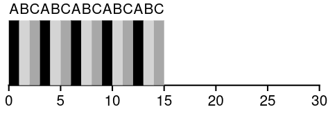

# sched/rr: Round Robin

## Overview
Round Robin is the simplest preemptive scheduling algorithm.<br>
Every runnable process is given an equal, fixed time slice called a **quantum**. 
When the quantum expires the process is preempted and moved to the back of the queue, and the next process runs.<br>
Over time every process gets an equal share of the CPU.



It's simple, fair and starvation free.

## Implementation
The runqueue is a **circular doubly linked-list** with the kernel idle process being the **sentinel node**.

It is tracked in the `sched_data` field of the runnable processes by this struct:
```c
struct rr_node
{
  struct process *prev;
  struct process *next;
  uint64_t ticks_left;  // remaining timer ticks before preemption
};
```